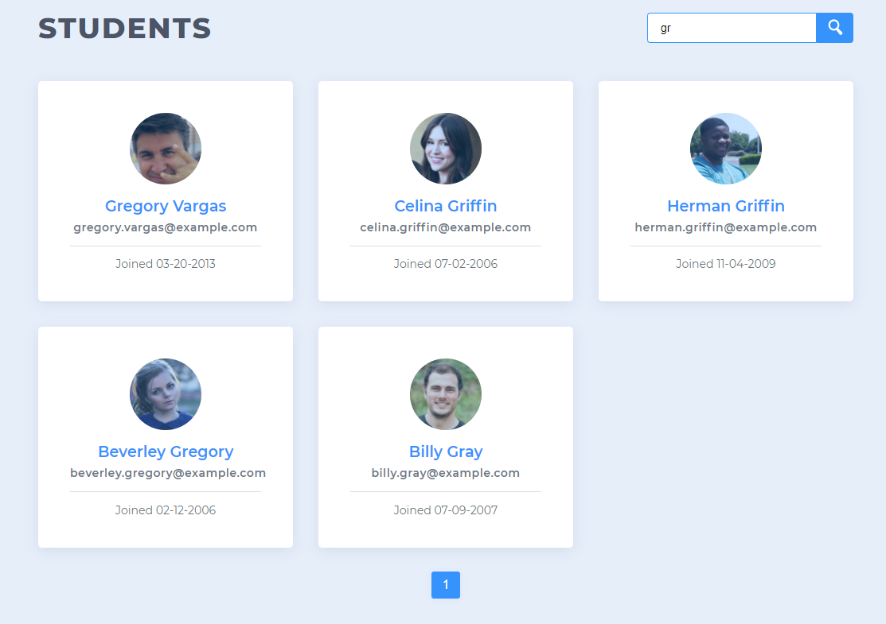

# Student Directory
A JavaScript site that displays a list of students from an included data file.

A live demo can be found [here](https://jimjitsuesq.github.io/portfolio-student-directory/).

## Table of Contents

* [General Info](#general-information)
* [Technologies Used](#technologies-used)
* [Features](#features)
* [Screenshots](#screenshots)
* [Contact](#contact)

## General Information
- This was the second project in my Team Treehouse Full-Stack JavaScript Tech Degree.
- I received a grade of "Exceeds Expectations" (the highest available).
- The main focuses included creating functions, working with arrays and implementing event listeners.

## Technologies Used
- JavaScript
- HTML
- CSS

## Features
- Search function
- Pagination of search results.

## Screenshots

## Contact
Created by [@jimjitsuesq](https://www.jimpeters.dev/).  Feel free to contact me!
